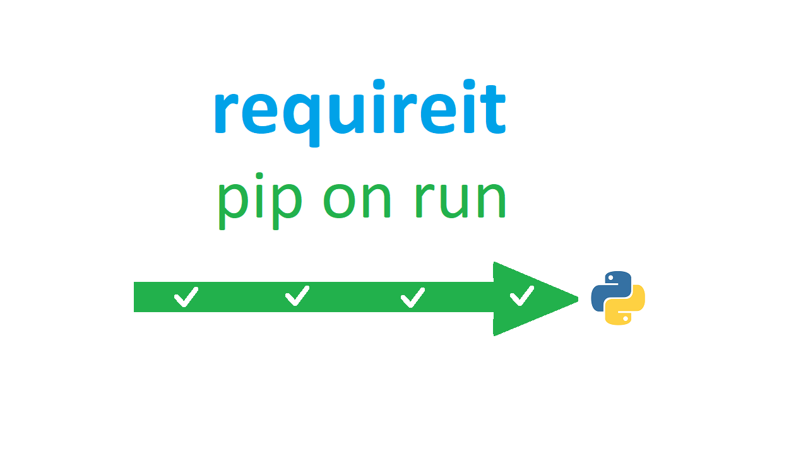

# requireit
  
Ever tried to get people to run your great code only to find out that they don't have all of the required packages? Requireit streamlines user experience by automatically installing libraries you don't have. It's as easy as pasting in less than 12 lines at the top of your code.  
  
## How to use
There are three versions of requireit:
1. The [full version](requireit.py?raw=true). It has docstrings and works if you paste it at the top of your code or if you include it.
2. The [mini version](requireitmini.py?raw=true). It's half as small as the full version, but has everything except docstrings and nice formatting.
3. The [mini inline version](requireitmini-inline.py?raw=true), only 13 lines. It is hard-coded so you have to paste it at the top of your code, or do this instead of an import:
```python3
exec(open("requireitmini-inline.py", "r").read())
```
Requireit is easy to use, no matter which version you choose. The mini inline version is recommended. Here's a simple example:
```
from pip._internal import main as A #code:https://github.com/KTibow/requireit
class VersionError(Exception):0
class InstallError(Exception):0
E="Couldn't auto-install ";F='install'
def requireit(B):
	for C in B:
		J=C if isinstance(C,str)else C[0]
		try:from importlib import import_module as L
		except ImportError:raise VersionError('Please upgrade Python')
		try: globals()[J]=L(J)
		except ModuleNotFoundError:
			try:A([F,C]) if isinstance(C,str)else A([F,C[1]]);globals()[J]=L(J)
			except Exception:raise InstallError(E+J)
requireit([["onedrivesdk", "git+https://github.com/OneDrive/onedrive-sdk-python.git"], "shutdown"])
# Requireit automatically imports and installs!
shutdown(time=120)
```
