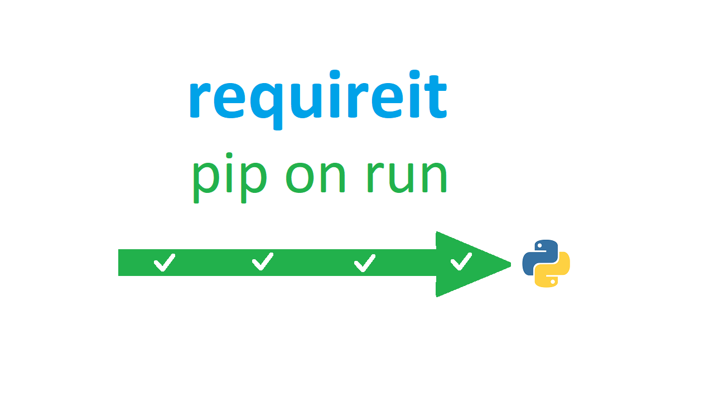

# requireit
  
Ever tried to get people to run your great code only to find out that they don't have all of the required packages? Requireit streamlines user experience by automatically installing libraries you don't have. It's as easy as pasting in 13 lines at the top of your code.  
  
## How to use
There are three versions of requireit:
1. The [full version](requireit.py?raw=true). It has docstrings and works if you paste it at the top of your code or if you include it.
2. The [mini version](requireitmini.py?raw=true). It's half as small as the full version, but has everything except docstrings and nice formatting.
3. The [mini inline version](requireitmini-inline.py?raw=true), only 13 lines. It is hard-coded so you have to paste it at the top of your code, or do this instead of an import:
```python3
exec(open("requireitmini-inline.py", "r").read())
```
Requireit is easy to use, no matter which version you choose. The mini inline version is recommended.
## Example
```python3
from pip._internal import main as A #code:https://github.com/KTibow/requireit
class VersionError(Exception):0
class InstallError(Exception):0
E="Couldn't auto-install ";F='install'
def requireit(B):
	for C in B:
		J=C if isinstance(C,str)else C[0]
		try:from importlib import import_module as L
		except ImportError:raise VersionError('Please upgrade Python')
		try: globals()[J]=L(J)
		except ModuleNotFoundError:
			try:A([F,C]) if isinstance(C,str)else A([F,C[1]]);globals()[J]=L(J)
			except Exception:raise InstallError(E+J)
requireit([["onedrivesdk", "git+https://github.com/OneDrive/onedrive-sdk-python.git"], "shutdown"])
# Requireit automatically imports and installs!
shutdown(time=120)
```
## (Tiny) Docs
Use the instructions [from earlier](#how-to-use). To require something, call `requireit` with your list of stuff.  
For custom sources, use a sub array. Example to install `shutdown` and `onedrivesdk`:
```python3
# Do your other code and add requireit here...
requireit([
         ["shutdown", "shutdown==0.0.1"],
         ["onedrivesdk", "git+https://github.com/OneDrive/onedrive-sdk-python.git"]
         ])
```
## What I think you'll frequently ask... (WITYFA)
### Why isn't this `README` longer?
`requireit` is simple, so this `README` is too.
### `emailHelpers`, one of your other projects is available on pip. Why isn't `requireit` available there too?
Because it wouldn't make sense to install a package that installs other packages.
### What should I do now?
- I'd appreciate it if you'd contribute to the repo. - Bundle `requireit` with your example code for your `pip` package, or with your code for anything that requires something installable from `pip`. 
- Spread the word. If you think `requireit` makes writing and running code easier, tell your friends.
### Badge me!
You can use `shields.io` for your badges. Here's some URLs for requireit. The first one is longer, and the second one is shorter.
```
https://img.shields.io/badge/smart%20dependency%20install-powered%20by%20requireit-099
https://img.shields.io/badge/dependencies-auto--installed-099
https://img.shields.io/badge/dependencies%20auto--installed-by%20requireit-099
```
In Markdown, use this:
```
[](https://github.com/KTibow/requireit/)  
[](https://github.com/KTibow/requireit/)  
[](https://github.com/KTibow/requireit/)  
```
They produce this:   
[](https://github.com/KTibow/requireit/)  
[](https://github.com/KTibow/requireit/)  
[](https://github.com/KTibow/requireit/)  
### Aah! It says:
```
WARNING: pip is being invoked by an old script wrapper. This will fail in a future version of pip.
```
Don't worry about this, basically it's complaining that I'm using a hacky method. If you're really cautious, put up this notice:
```
If there's an error near the start of the code, try instead manually installing the dependencies and removing anything about `requireit`. You can [let them know about it here](https://github.com/KTibow/requireit/issues/new/choose).
```
## Bye! 👋  
